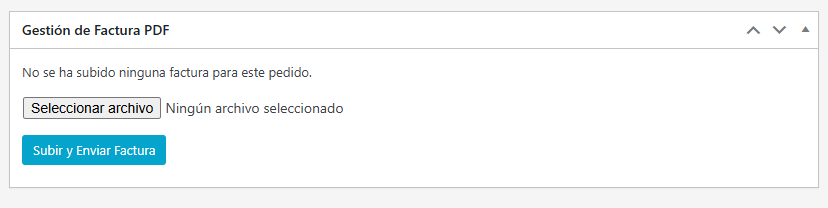
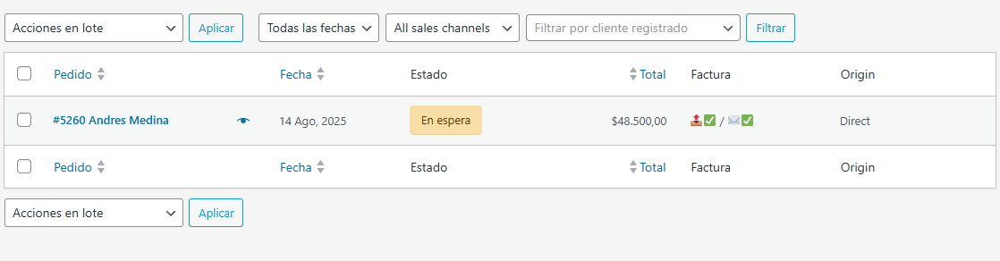

# Gestor de Facturas WooCommerce (HPOS Compatible)

Plugin para WordPress que permite subir y enviar facturas PDF desde el área de administración de pedidos de WooCommerce, compatible con HPOS (High-Performance Order Storage).

## 🚀 Características principales

- ✅ Subida de facturas PDF directamente desde el pedido
- ✅ Envío automático al cliente por email
- ✅ Compatibilidad completa con HPOS (nuevo sistema de órdenes de WooCommerce)
- ✅ Interfaz AJAX sin recargas de página
- ✅ Columnas personalizadas en el listado de pedidos
- ✅ Validación de archivos PDF (tipo y tamaño)
- ✅ Registro detallado de errores para diagnóstico
- ✅ Registro automático en las notas del pedido (auditoría de envío)

## � Capturas de Pantalla

| Metabox de Gestión | Columna en Pedidos |
|:------------------:|:------------------:|
|  |  |

## �📦 Requisitos

- WordPress 5.6+
- WooCommerce 7.0+
- PHP 7.4+
- Acceso a servidor SMTP para envío de emails (recomendado)

## 🛠 Instalación

1. Descarga el archivo ZIP del plugin
2. En tu WordPress, ve a `Plugins > Añadir nuevo > Subir plugin`
3. Selecciona el archivo ZIP y haz clic en "Instalar ahora"
4. Activa el plugin

## ⚙️ Configuración

El plugin funciona automáticamente sin configuración adicional. Para mejor funcionamiento:

1. Configura un plugin SMTP como "WP Mail SMTP" para el envío de emails
2. Asegúrate que el directorio `wp-content/uploads/` tenga permisos de escritura

## 🖥 Uso

1. Ve a `WooCommerce > Pedidos`
2. Abre un pedido existente
3. En el metabox "Gestión de Factura PDF":
   - Selecciona un archivo PDF
   - Haz clic en "Subir y Enviar Factura"
4. El sistema subirá el archivo y lo enviará automáticamente al cliente

## 📝 Notas importantes

- Tamaño máximo de archivo: 1MB
- Solo se aceptan archivos PDF
- Los archivos se guardan en `wp-content/uploads/gfwc-invoices/YYYY/MM/`
- Se registran errores en `wp-content/debug.log`

## 🐛 Reporte de problemas

Si encuentras algún problema, por favor:
1. Revisa los logs en `wp-content/debug.log`
2. Abre un issue en [GitHub](https://github.com/Charlyzeta/gestor-facturas-woocommerce/issues)
3. Proporciona detalles del error y capturas de pantalla si es posible

## 📜 Licencia

Este plugin es software libre bajo licencia GPLv2 o posterior.

## ✨ Changelog

### 2.4.0
- Compatibilidad completa con HPOS
- Mejor manejo de errores
- Plantilla de email mejorada
- Validación de archivos más robusta

### 2.0.0
- Versión inicial con funcionalidad básica